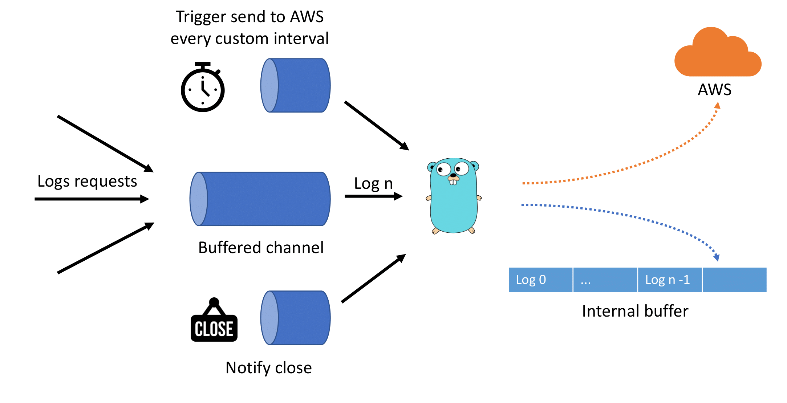
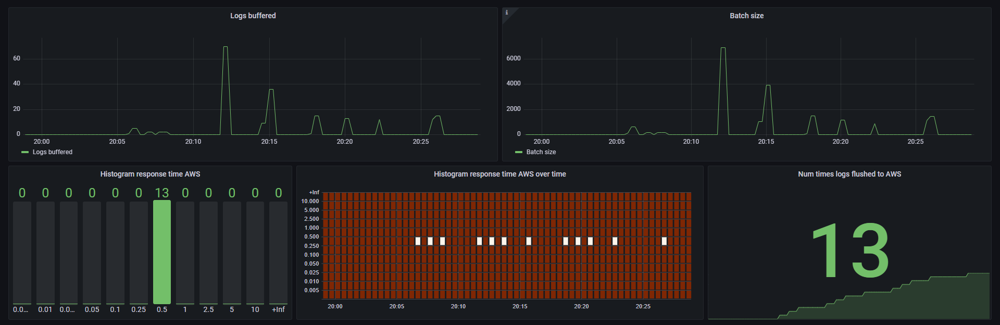

# CloudWatchLogs Wrapper

CloudWatchLogs client that provides AWS SDK is a good option to deal with the API, 
however requires a low level control for the end user. So this library **creates a
layer of abstraction** on top of an AWS client.

## Usage
In order to instantiate this wrapper you need to provide an AWS client and the 
Options to configure some settings.

```go
type WrapperOptions struct {
	logGroup      string
	logStream     string
	retentionDays RetentionPolicy
	logsPerBatch  uint
	batchSize     uint
	sendAfter     time.Duration
}
```

To set up this config you should use the provided constructor `NewWrapperOptions` 
that validates some fields. Notice that the package provides some constants, like
`MaxBatchSize` or `MaxLogEventsPerBatch`. Regarding the retentionDays, this 
package provides a set of constants with the allowed values.

:warning: This package creates a logGroup (or uses an existing one), however, 
**logStream must be a new one** (in general is a good practice to separate streams
by some combination of variables like  ip, timestamp, pod name or some other criteria, 
to identify which instance is producing the logs).

Once everything it's set up, it's straightforward:
```go
wrapper, err := New(ctx, clientAws, &opts)
if err != nil ...
defer func() {
    wrapper.Close()
}()
wrapper.Log("Log here!")
```

## Scenarios that produce sending the logs to AWS

- Number of items in the buffer is the same as configured in logsPerBatch.
- When adding the incoming log would produce exceeding the batchSize.
- When has gone by a specific amount of time since last time they were sent.
- When `Close` is being called, waits for the remaining logs to be processed and sends them.


## Internals

Internally there is a goroutine that orchestrates the incoming requests.


The main benefit of using a **buffered channel** is that clients using
this wrapper can put the log and continue **without having to wait** for
the batch to be sent.

```go
func (c *CloudwatchLogsWrapper) handleRequests(ctx context.Context) {
	finish := false
	for {
		select {
		case <-c.tickerSendToAws.C:
			c.sendToCloudwatch(ctx)
		case logEvent := <-c.logEvents:
			c.addLogEvent(ctx, logEvent)
		case <-c.notifyClose:
			finish = true
		}
		
		if finish && len(c.logEvents) == 0 {
			log.Println("finish requested and no pending messages")
			c.sendToCloudwatch(ctx)
			c.closeDone <- struct{}{}
			return
		}
	}
}
```

## Integration tests
If you want to try it without having to send the data to AWS, the integration
tests are already written using [LocalStack](https://localstack.cloud/). This tool
allows you to simulate real AWS services. To run the tests simply run:

```text
go test ./... --tags integration
```

## Metrics
This package is ready to publish some internal metrics to **Prometheus** out of
the box. The main information is related with the number of items and size of the 
batch. But also provides information about the response time when uploading the
logs to AWS.


